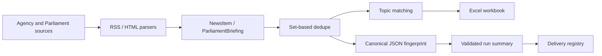

# UK News Scraper Architecture

## Data Flow

The v2 preview implements the pipeline as a Rust workspace. Python remains the production
fallback during parallel validation. Both implementations preserve the same Excel,
fingerprint v3, run-summary, profile, and delivery-registry contracts.

## Module Responsibilities

- `uk-news-core`: domain models, profile schema, relevance and fingerprint v3.
- `uk-news-sources`: bounded asynchronous RSS, official-page and Parliament parsing.
- `uk-news-export`: four-sheet XLSX output with bilingual rows and hyperlinks.
- `uk-news-app`: orchestration, translation providers, profiles and delivery registry.
- `native/apps/desktop`: the Tauri binary and React/TypeScript workspace.

## Data-Structure Choices And Complexity

| Operation | Time | Space |
| --- | --- | --- |
| Set-based news dedupe | `O(n)` average | `O(n)` |
| Date ordering | `O(n log n)` | `O(n)` |
| Topic matching | `O(n * r * k)` for records, rules, keywords | result lists |
| Canonical fingerprint | `O(n log n)` due to record ordering | `O(n)` |
| Delivery registry lookup | average `O(1)` in loaded JSON object | `O(d)` registry |

Canonical JSON is used instead of delimiter-joined strings so field boundaries cannot
collide. Sorting records keeps fingerprints independent of source completion order.

## Error And Retry Policy

Each agency and Parliament source emits independent health state. A supplemental-page
failure retains successful RSS data and marks the run degraded. Delivery remains gated by
the atomic claim, explicit Gmail success, and complete transition described in
`docs/adr/0001-idempotent-delivery-and-retry-policy.md`.
