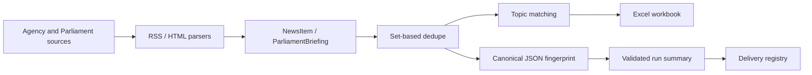

# UK News Scraper Architecture

## Data Flow

The scraper keeps external payloads at parser boundaries and converts them into domain
dataclasses. Excel and run-summary JSON are output DTOs. The delivery registry validates
the run-summary schema before claiming a send.

## Module Responsibilities

- `models.py`: agencies, news, briefings, health, and run-state enums.
- `scrapers/`: external payload parsing.
- `dedupe.py`: stable set-based duplicate removal.
- `excel_exporter.py`: workbook creation and verification.
- `run_summary.py`: canonical fingerprint and JSON schema validation.
- `delivery_registry.py`: atomic delivery state transitions.

## Data-Structure Choices And Complexity

| Operation | Time | Space |
| --- | --- | --- |
| Set-based news dedupe | `O(n)` average | `O(n)` |
| Date ordering | `O(n log n)` | `O(n)` |
| Topic matching | `O(n * r * k)` for records, rules, keywords | result lists |
| Canonical fingerprint | `O(n log n)` due to record ordering | `O(n)` |
| Delivery registry lookup | average `O(1)` in loaded JSON object | `O(d)` registry |

Canonical JSON is used instead of delimiter-joined strings so field boundaries cannot
collide. Sorting records keeps fingerprints independent of source completion order.

## Error And Retry Policy

`errors.py` separates download, parse, validation, and storage failures. Only
`DownloadError` enters the second agency-fetch round. See
`docs/adr/0001-idempotent-delivery-and-retry-policy.md`.
